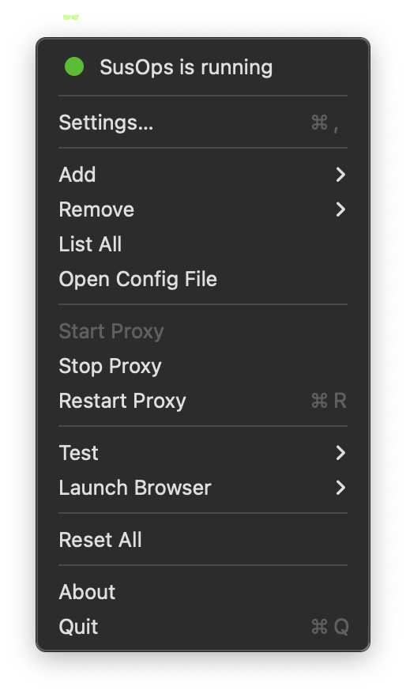

# SusOps App for macOS

A native-feeling **menu-bar app** for the [**SusOps CLI**](https://github.com/mashb1t/susops-cli) SSH–proxy
and forwarding toolkit. **SusOps CLI** is already bundled, no need to manually download it (again).

Built with [`rumps`](https://github.com/jaredks/rumps), the app lets you start/stop the SusOps SOCKS proxy, add
local / remote port-forwards, and tweak settings without touching a terminal.

## Features

| Menu action                         | CLI equivalent              | What it does                                             |
|-------------------------------------|-----------------------------|----------------------------------------------------------|
| **Start / Stop / Restart Proxy**    | `so start / stop / restart` | Launch or tear down SOCKS5+ PAC server via SSH.          |
| **Add Host…**                       | `so add <domain>`           | Add a domain to the PAC file.                            |
| **Add Local Forward…** (from → to)  | `so add -l REMOTE LOCAL`    | Expose a remote service on `localhost:<LOCAL>`.          |
| **Add Remote Forward…** (from → to) | `so add -r LOCAL REMOTE`    | Publish a local port on `ssh_host:<REMOTE>`.             |
| **Status…**                         | `so ps`                     | Show running state and active forwards.                  |
| **Preferences…**                    | edit dot‑files              | GUI for SSH host & port defaults; optional auto‑restart. |
| **Test Host / Test All**            | `so test …`                 | Quick connectivity test dialogs.                         |

## Requirements

The app may be compatible with older versions of macOS, but it is not tested.

* macOS 15.4.1+
* Python 3.12+ (for building only)
* A remote host you have ssh access to

## Setup

1. Download the SusOps.zip file from the [latest release](https://github.com/mashb1t/susops-mac/releases)
2. Unzip the file
3. (Optional) Move the SusOps app to your Applications folder
4. Launch the application
> [!NOTE]
> The app is not signed, you may need to allow its startup in **System Settings** > **Privacy & Security**. If this does not 
5. Set up your SSH host and ports in the **Preferences** menu 
6. Start the proxy (menu bar icon should turn green)
7. Add domains (requires browser restart) or port-forwards (requires proxy restart)

## Build from source (development)

```bash
# 1 – Clone with submodule
git clone --recursive https://github.com/mashb1t/susops-mac.git
cd susops-mac

# 2 – Create a venv & install deps
python3 -m venv .venv
source .venv/bin/activate
pip install -r requirements.txt

# optional
# 3 – Build the .app bundle
python setup.py py2app

# 4 – Launch
open dist/SusOps.app
```

> [!IMPORTANT]
> The [**SusOps CLI**](https://github.com/mashb1t/susops-cli) lives in its own repository and is included here as a **git submodule**.  
> Make sure you clone with `--recursive` or run `git submodule update --init` after checkout.

The build embeds **`susops.sh`** and all logo assets under `Contents/Resources/`.

## Runtime files

| Location     | Purpose                         |
|--------------|---------------------------------|
| `~/.susops/` | Same config files the CLI uses. |

## Screenshots



## Contributing

1. Set up the project as described above in "Build from source (development)".
2. Create a feature branch.
3. `python app.py` while hacking UI.
4. `python setup.py py2app` to test the packaged app.
5. Open a [PR](https://github.com/mashb1t/susops-mac/pulls).

## License

MIT © 2025 Manuel Schmid — see `LICENSE`.
[**SusOps CLI**](https://github.com/mashb1t/susops-cli) (submodule) retains its own license.
